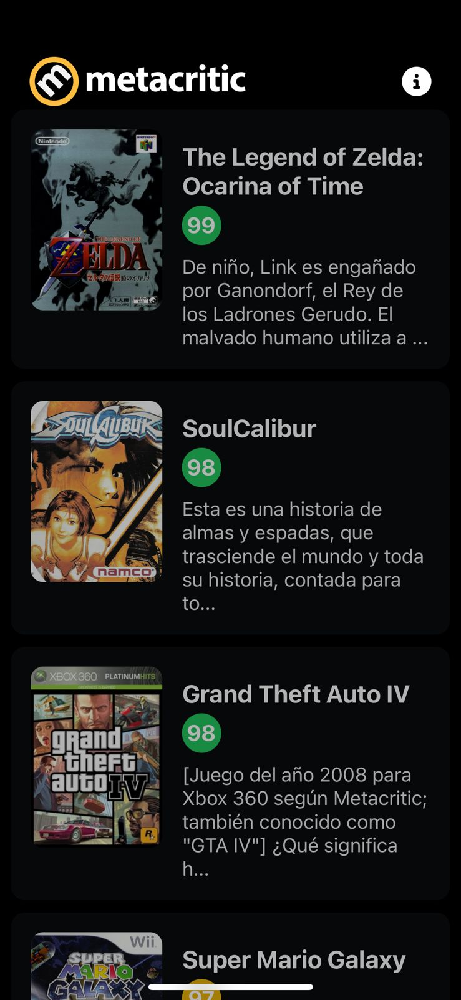

# Proyecto Móvil de GameCritic

¡Bienvenido al proyecto móvil de GameCritic! Esta es una aplicación móvil desarrollada en React Native que permite a los usuarios ver reseñas de algunos juegos populares, junto con sus respectivas descripciones, puntuaciones y más.

## Descripción

La aplicación de GameCritic para móviles te permite:
- Ver reseñas detalladas de cada juego, incluyendo puntajes, descripciones, plataformas, y géneros.
- Explorar diferentes juegos a través de una interfaz de usuario intuitiva y fácil de usar.

## Características

- **Interfaz amigable**: Navegación simple y diseño visual atractivo.
- **Reseñas detalladas**: Obtén información de los juegos más populares de GameCritic.
- **Modo oscuro**: Compatible con modo oscuro para una mejor experiencia de usuario.

## Tecnologías Utilizadas

- **React Native**: Framework para el desarrollo de aplicaciones móviles multiplataforma.
- **Expo**: Plataforma para desarrollar aplicaciones React Native.
- **Axios**: Librería HTTP para hacer solicitudes a la API de GameCritic.
- **Tailwind CSS**: Utilizado para un estilo rápido y eficiente.
- **Context API**: Para el manejo del estado global de la aplicación.

